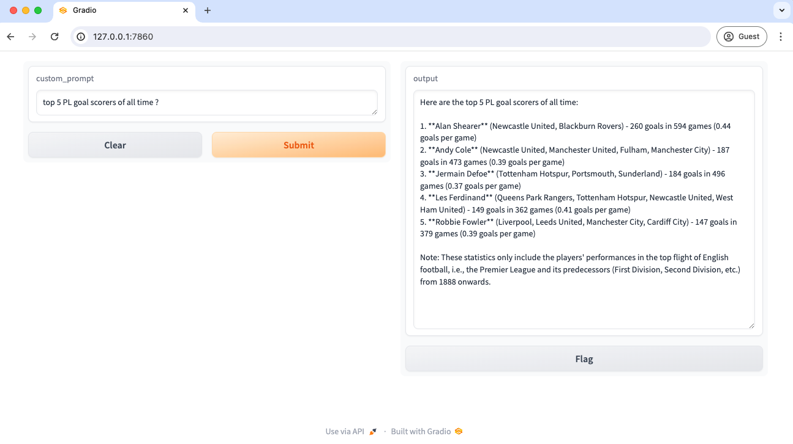
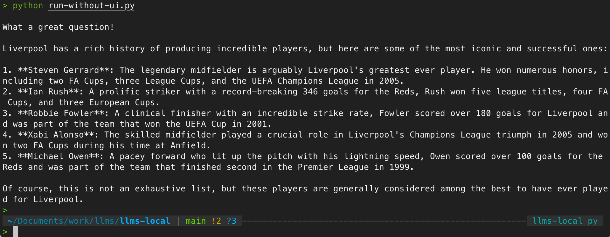
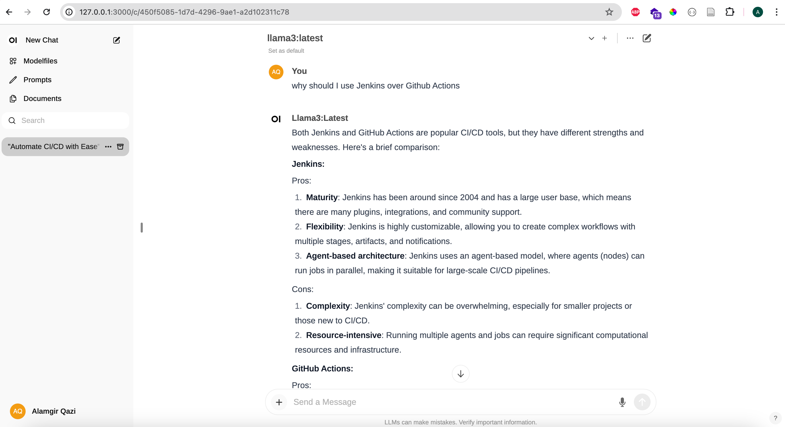

# A simple repo which shows you how you can run LLMs offline / locally on your laptop 

## Setup

#### Make sure you have ollama installed locally (https://ollama.com/)

Once Ollama is installed, Go to http://localhost:11434/ to confirm if its running.

`ollama run llama3` 

#### Setup Python environment

```
pipenv shell

pip install -r requirements.txt
```

#### There are many ways to run it

1. LLM with UI (Gradio)

```
python main.py
```

head over to [http://127.0.0.1:7860]




2. LLM without UI (Console)
   
```
python run-without-ui.py
```




3. Ollama Web UI Lite 🦙 (Recommended)

Make sure you have Node.js installed. 

```
git clone https://github.com/ollama-webui/ollama-webui-lite.git
cd ollama-webui-lite

npm ci

npm run dev
```

Ollama Web UI Lite now should be available at http://localhost:3000


4. Open WebUI (suggested)

```
docker run -d -p 3000:8080 --add-host=host.docker.internal:host-gateway -v open-webui:/app/backend/data --name open-webui --restart always ghcr.io/open-webui/open-webui:main
```

head over to [http://127.0.0.1:3000]



